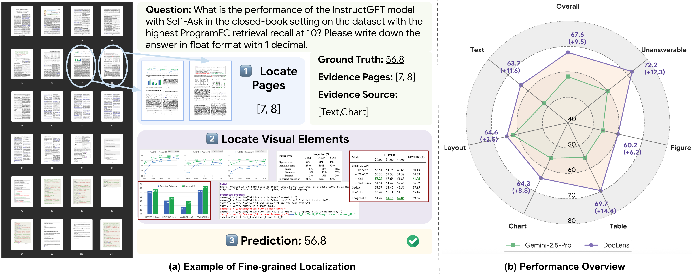

# <div align="center">DocLens 🔍</div>
<div align="center">Dawei Zhu, Rui Meng, Jiefeng Chen, Sujian Li, Tomas Pfister, Jinsung Yoon
<br><br></div>
This repository is the official implementation for the paper "DocLens: A Tool-Augmented Multi-Agent Framework for Long Visual Document Understanding". Acting like a lens 🔍 that effectively ``zoom-in'' on relevant information, it first navigates from the full document to specific visual elements on relevant pages, then employs a sampling-adjudication mechanism to generate a single, reliable answer. Paired with Gemini-2.5-Pro, this method establishes a new state-of-the-art on MMLongBench-Doc, and for the first time, surpasses human experts.


## Overview of DocLens


DocLens achieves its remarkable performance by fully leveraging existing document parsing tools and orchestrating specialized agents.
Given a long visual document and a corresponding question, DocLens first applies a tool-augmented **Lens Module** to retrieve relevant pages (Page Navigator Agent) and locate relevant visual and textual elements (Element Localizer Agent) within these pages. We then use a **Reasoning Module** to perform in-depth analysis of these elements, provide candidate answers (Answer Sampler Agent), and pick the most accurate and reliable one (Adjudicator Agent).
## Quick Start
### Clone the Repo
```bash
git clone https://github.com/dwzhu-pku/DocLens.git
cd DocLens
```
### Installing Environment
1. We use uv to manage Python packages. Please install uv following the instructions [here](https://docs.astral.sh/uv/getting-started/installation/).
2. Create and activate a virtual environment
    ```bash
    uv venv # This will create a virtual environment in the current directory, under .venv/
    source .venv/bin/activate
    ```
3. Install python 3.12
    ```bash
    uv python install 3.12
    ```
4. Install required packages
    ```bash
    uv pip install -U "mineru[core]"
    uv pip install pymupdf
    uv pip install google-genai
    ```
5. Configure model credentials
    ```bash
    cp .env.example .env
    # Edit .env with your own credentials before running the scripts.
    export $(grep -v '^#' .env | xargs)
    ```

    Required environment variables:
    - `GOOGLE_CLOUD_PROJECT`: Google Cloud project used by Vertex AI Gemini/Claude.
    - `GOOGLE_CLOUD_LOCATION`: Vertex AI location, defaults to `us-east1`.
    - `ANTHROPIC_VERTEX_REGION`: Anthropic Vertex region, defaults to `global`.
    - `QWEN_BASE_URL`: OpenAI-compatible Qwen endpoint, defaults to SiliconFlow.
    - `QWEN_API_KEY`: API key for the Qwen endpoint.

### Preprocess:
1. Download datasets from [Hugging Face](https://huggingface.co/datasets/dwzhu/DocLensDatasets)
    ```bash
    python utils/download_dataset.py
    ```
2. Convert all pages in the pdf files into images
    ```bash
    bash scripts/run_convert_doc_to_image.sh
    ```
3. Parse all the visual and textual elements in each page
    ```bash
    bash scripts/run_parse_document.sh
    ```

### Launch DocLens
The easiest way to launch DocLens is via the end-to-end script:
```bash
bash scripts/run_doclens_end2end.sh
```
Essentially, our framework includes two phases, phase 1 for locating evidence pages (and elements), and phase 2 for answer sampling and adjudication. So, you can also launch these two phases consecutively:
```bash
# Phase 1: Locate evidence pages (and elements)
bash scripts/run_doclens_phase1.sh
# Phase 2: Answer Sampling and Adjudication
bash scripts/run_doclens_phase2.sh
```
This is convenient for development purposes, if one would like to modify the design choices in phase 1 or phase 2, and ablate its effectiveness.


## Project Structure
```
├── .venv
│   ├── ...
├── data
│   ├── MMLongBenchDoc
│       ├── documents
│           ├── 2005.12872v3.pdf
│           ├── ...
│       ├── samples.json
│   ├── FinRAGBench-V
│   ├── ...
├── agents
│   ├── __init__.py
│   ├── adjudicator_agent.py
│   ├── answer_sampler_agent.py
│   ├── base_agent.py
│   └── page_navigator_agent.py
├── preprocess
│   ├── doc_parse_parallel_mineru.py
│   └── pdf_to_images.py
├── prompts
│   ├── __init__.py
│   ├── agent_prompts.py
│   └── eval_prompts.py
├── scripts
│   ├── run_convert_doc_to_image.sh
│   ├── run_doclens_end2end.sh
│   ├── run_doclens_phase1.sh
│   ├── run_doclens_phase2.sh
│   └── run_parse_document.sh
│── utils
│   ├── __init__.py
│   ├── config.py
│   ├── doclens_processor.py
│   ├── eval_toolkits.py
│   └── generation_utils.py
├── main.py
│── results_[model_name]
│   │── MMLongBenchDoc
│   │── FinRAGBench-V
├── README.md
```
## Citation
If you find this repo helpful, please cite our paper as follows:
```bibtex
@inproceedings{zhu2026doclens,
  title={Doclens: A tool-augmented multi-agent framework for long visual document understanding},
  author={Zhu, Dawei and Meng, Rui and Chen, Jiefeng and Li, Sujian and Pfister, Tomas and Yoon, Jinsung},
  booktitle={Proceedings of the 64th Annual Meeting of the Association for Computational Linguistics (Volume 1: Long Papers)},
  pages={26804--26829},
  year={2026}
}
```
